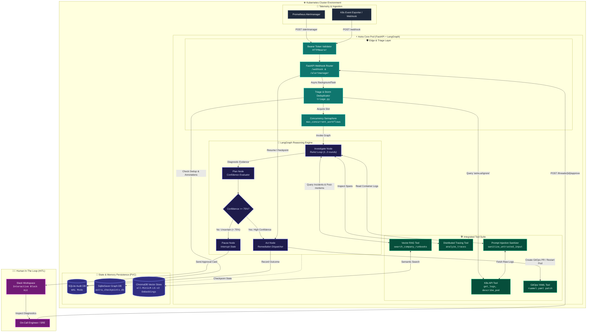
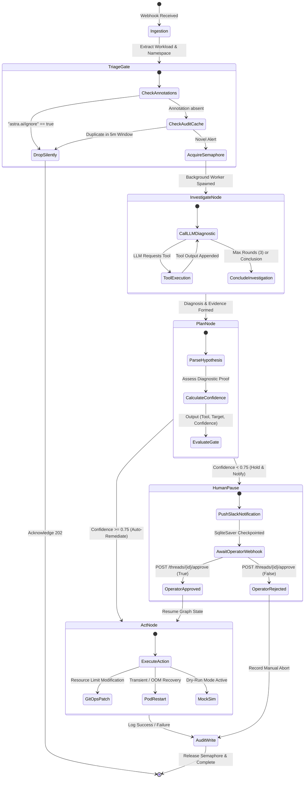
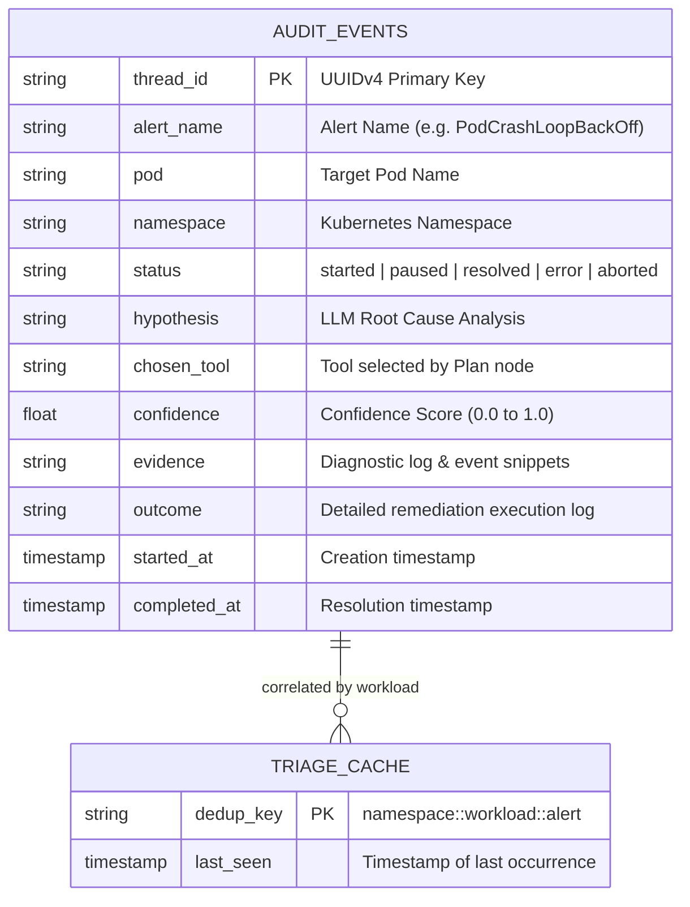

# 🏛️ Astra — Enterprise System Design & Engineering Architecture

> **Document Version:** `2.0.0-Enterprise`  
> **Status:** `Approved / Production Reference`  
> **Target Audience:** Principal Systems Architects, Staff SREs, Platform Engineers, Security Reviewers

---

## 📑 Table of Contents

1. [Architectural Overview & Core Philosophy](#1-architectural-overview--core-philosophy)
2. [C4 Level-2 Container & Dataflow Architecture (Mermaid)](#2-c4-level-2-container--dataflow-architecture)
3. [LangGraph ReAct State Transition Engine](#3-langgraph-react-state-transition-engine)
4. [End-to-End Distributed Sequence Flow](#4-end-to-end-distributed-sequence-flow)
5. [Complete Codebase File Topology & Dependency Graph](#5-complete-codebase-file-topology--dependency-graph)
6. [Architectural Decision Records (ADRs) — Technology Rationale](#6-architectural-decision-records-adrs--technology-rationale)
7. [Database Schema & State Persistence Model](#7-database-schema--state-persistence-model)
8. [Failure Modes, Self-Healing & Resilience Matrix](#8-failure-modes-self-healing--resilience-matrix)
9. [Enterprise Security, RBAC & Isolation Model](#9-enterprise-security-rbac--isolation-model)

---

## 1. Architectural Overview & Core Philosophy

Astra is an autonomous, air-gapped AIOps remediation engine designed to operate directly inside Kubernetes clusters. Unlike passive monitoring tools that simply broadcast alerts to human on-call engineers, Astra acts as a **closed-loop autonomous reasoning agent**:

```
[ Ingest ] ──► [ Deduplicate & Gate ] ──► [ Multi-Step ReAct Diagnostics ] ──► [ Confidence Scored Remediation ] ──► [ GitOps PR / Audit ]
```

### Core Architectural Invariants
1. **Zero-Block Async Ingestion:** Webhooks must acknowledge in `< 5ms` with `202 Accepted` to prevent Alertmanager webhook timeouts.
2. **Deterministic Rate Throttling:** Background execution is guarded by an `asyncio.Semaphore` to protect LLM providers from rate exhaustion (HTTP 429).
3. **Multi-Round Evidence Collection:** The LLM is never allowed to hallucinate a fix from the alert name alone. It must execute 1 to 3 rounds of active diagnostics (`get_logs`, `describe_pod`, `analyze_traces`, `search_company_runbooks`).
4. **Declarative GitOps over Imperative Mutation:** Where possible, fixes are committed as structured YAML modifications via Git branch/PR (`ruamel.yaml`) rather than raw cluster alterations.
5. **Air-Gapped Privacy & No Cloud Leakage:** All vector search embeddings (`all-MiniLM-L6-v2`) and state graphs (`SqliteSaver`) run 100% on-premises without egressing logs or manifests to external services.

---

## 2. C4 Level-2 Container & Dataflow Architecture

The following diagram illustrates the boundary between the Kubernetes infrastructure, the Astra core services, the persistent storage engines, and human operators.



---

## 3. LangGraph ReAct State Transition Engine

Astra leverages **LangGraph** to model the diagnosis and remediation lifecycle as a cyclic state machine. If an investigation requires additional logs, trace queries, or historical runbooks, the agent loops dynamically until it has gathered sufficient empirical evidence.



---

## 4. End-to-End Distributed Sequence Flow

The sequence diagram below models the exact timeline and asynchronous boundaries across all system participants during an incident.

```mermaid
sequenceDiagram
    autonumber
    actor AlertSource as ☸️ Alertmanager / K8s
    participant FastAPILayer as 🚀 FastAPI (routes.py)
    participant TriageEngine as 🛡️ Triage (triage.py)
    participant Sem as 🚦 Semaphore Gate
    participant Worker as 🧵 Async Thread Worker
    participant Graph as 🧠 LangGraph (nodes.py)
    participant Tools as 🛠️ K8s / Trace / RAG
    participant SlackService as 💬 Slack HITL
    actor Operator as 🧑‍💻 On-Call SRE
    participant AuditStore as 🗄️ SQLite Audit

    AlertSource->>FastAPILayer: POST /webhook {alert, pod, namespace}
    Note over FastAPILayer: Verify Bearer Token in < 1ms
    FastAPILayer->>TriageEngine: should_triage_suppress(payload)
    TriageEngine->>Tools: get_pod_annotations(pod)
    Tools-->>TriageEngine: Annotations { "astra.ai/ignore": "false" }
    TriageEngine->>AuditStore: Query deduplication cache (5m window)
    AuditStore-->>TriageEngine: Cache Miss (Novel Incident)
    
    FastAPILayer-->>AlertSource: HTTP 202 Accepted {status: "processing", thread_id}
    
    FastAPILayer->>Worker: Dispatch BackgroundTask(_run_workflow)
    Worker->>Sem: Acquire Semaphore Slot (Max 10)
    Sem-->>Worker: Slot Granted
    
    Worker->>AuditStore: record_workflow_start(thread_id, alert, pod)
    
    rect rgb(30, 27, 75)
        Note over Worker,Graph: 🔄 LangGraph ReAct Diagnostic Loop
        Worker->>Graph: stream(init_state, config)
        Graph->>Tools: describe_pod(pod, namespace)
        Tools-->>Graph: Status: CrashLoopBackOff, Exit Code: 137 (OOM)
        Graph->>Tools: search_company_runbooks("OOM CrashLoopBackOff 137")
        Tools-->>Graph: Match: rb-001 (Increase Memory Limit via GitOps)
        Graph->>Graph: Plan Node: Confidence = 0.65 (Below Threshold)
    end
    
    Graph->>SlackService: send_hitl_request(thread_id, diagnostics, proposed_tool)
    SlackService->>Operator: Deliver Interactive Slack Approval Card
    
    Note over Graph,AuditStore: State checkpointed in SqliteSaver (Worker sleeps)
    
    Operator->>FastAPILayer: POST /threads/{thread_id}/approve {approved: true}
    FastAPILayer->>Graph: Resume Execution from Checkpoint
    Graph->>Tools: gitops_patch(pod, "limits.memory", "512Mi")
    Tools-->>Graph: Created Branch: astra/fix-resources-auth-service
    
    Graph->>AuditStore: record_workflow_outcome(thread_id, outcome="resolved")
    Worker->>Sem: Release Semaphore Slot
```



---

## 5. Complete Codebase File Topology & Dependency Graph

Every file in the Astra architecture has a singular, decoupled responsibility:

```
astra/
├── app/
│   ├── main.py                  # [Application Host] Lifespan events, DB init, OpenAPI setup, Prometheus mount
│   │
│   ├── agent/                   # [Reasoning Core]
│   │   ├── graph.py             # LangGraph compilation, StateGraph topology, SqliteSaver binding
│   │   ├── nodes.py             # ReAct investigate, plan, act node functions, tenacity retries, JSON parsers
│   │   └── state.py             # TypedDict schema defining the mutable state passed between nodes
│   │
│   ├── api/                     # [Interface & Protocol Layer]
│   │   ├── routes.py            # HTTP endpoints (/webhook, /alertmanager, /threads, /history), Semaphore
│   │   ├── schemas.py           # Pydantic v2 validation models for incoming alerts and response envelopes
│   │   └── metrics.py           # Prometheus instruments (QUEUED_WORKFLOWS, CONFIDENCE_HISTOGRAM, etc.)
│   │
│   ├── core/                    # [Foundation & Configuration]
│   │   ├── config.py            # Pydantic Settings (.env loader, thresholds, credentials)
│   │   └── logging.py           # Structured JSON logger with context variables & correlation IDs
│   │
│   ├── db/                      # [Data Persistence]
│   │   ├── database.py          # SQLite engine setup, WAL mode activation, table DDL creation
│   │   └── models.py            # Audit event data classes
│   │
│   ├── services/                # [Domain Business Logic]
│   │   ├── triage.py            # Alert storm suppression, workload regex parsing, annotation checks
│   │   ├── rag.py               # ChromaDB client, HuggingFace embeddings, similarity search
│   │   ├── audit.py             # Audit trail transaction logger (start, outcome, history fetch)
│   │   ├── slack.py             # Slack Block Kit payload generation & webhook dispatch
│   │   └── alertmanager.py      # Prometheus Alertmanager webhook payload unpacker & normalizer
│   │
│   └── tools/                   # [Diagnostic & Remediation Tooling]
│       ├── k8s_tools.py         # Kubernetes Python SDK driver (get_logs, describe_pod, restart_pod)
│       ├── gitops_tools.py      # ruamel.yaml AST manipulator for non-destructive deployment patching
│       ├── rag_tools.py         # LangChain @tool wrapper for semantic runbook retrieval
│       ├── trace_tools.py       # Distributed trace & latency bottleneck analyzer
│       └── security.py          # Prompt injection XML log wrapping & control character sanitizer
│
├── helm/astra/                  # [Enterprise Packaging]
│   ├── Chart.yaml               # Helm chart metadata
│   ├── values.yaml              # Global enterprise configuration values
│   └── templates/               # Kubernetes resource templates (Deployment, RBAC, PVC, Secret)
│
├── scripts/                     # [Developer Operations & Seeding]
│   ├── dev.py                   # Unified CLI runner (start, test, clean, check)
│   └── seed_runbooks.py         # Knowledge base ingestion CLI with 5 built-in enterprise runbooks
│
└── tests/                       # [Verification Suite]
    ├── conftest.py              # Pytest fixtures & isolated thread_id generators
    ├── test_phase1.py           # 23-test mock LLM reasoning, parsing, & graph execution suite
    └── test_triage.py           # Triage suppression & workload regex test suite
```

### Detailed File Interconnection Matrix

| Source File | Imports / Calls | Purpose of Connection |
|---|---|---|
| `app/main.py` | `app/api/routes.py`, `app/api/metrics.py`, `app/db/database.py` | Mounts endpoints, binds metrics exporter, initializes SQLite tables on startup. |
| `app/api/routes.py` | `app/agent/graph.py`, `app/services/triage.py`, `app/services/audit.py` | Validates auth, runs triage, acquires semaphore, offloads graph to background thread. |
| `app/agent/graph.py` | `app/agent/nodes.py`, `app/agent/state.py` | Defines graph nodes (`investigate`, `plan`, `act`), conditional edges, and SqliteSaver checkpointing. |
| `app/agent/nodes.py` | `app/tools/*`, `app/core/config.py`, `app/api/metrics.py` | Executes ReAct loop with LLM, calls diagnostic tools, tracks Prometheus metrics. |
| `app/services/triage.py` | `app/tools/k8s_tools.py`, `app/db/database.py` | Checks `astra.ai/ignore` annotation from K8s and deduplicates alerts via SQLite cache. |
| `app/tools/gitops_tools.py` | `ruamel.yaml` | Performs comment-preserving YAML edits on Kubernetes deployment manifests. |
| `app/tools/rag_tools.py` | `app/services/rag.py` | Provides `@tool` decorator so the LLM can search ChromaDB runbooks during ReAct reasoning. |

---

## 6. Architectural Decision Records (ADRs) — Technology Rationale

```
ADR-001: LangGraph vs. Raw LangChain / Autogen / CrewAI
ADR-002: Local HuggingFace all-MiniLM-L6-v2 vs. OpenAI Embeddings
ADR-003: SQLite WAL Mode + SqliteSaver vs. PostgreSQL
ADR-004: ruamel.yaml vs. PyYAML for GitOps Mutations
ADR-005: Async BackgroundTasks + Semaphore vs. Celery/RabbitMQ
```

### ADR-001: LangGraph for Stateful ReAct Reasoning
* **Decision:** Use LangGraph `StateGraph` with explicit state transitions over linear chains or unconstrained multi-agent frameworks (CrewAI/AutoGen).
* **Rationale:** Infrastructure remediation requires strict determinism. LangGraph provides first-class state checkpointing (`SqliteSaver`), allows precise control over cyclical ReAct loops (limiting diagnostics to max 3 rounds), and provides native pause/resume capabilities for Human-in-the-Loop workflows.
* **Alternative Rejected:** CrewAI/AutoGen agents frequently hallucinate infinite communication loops and lack deterministic serialization for human approval pauses.

### ADR-002: Local `all-MiniLM-L6-v2` ChromaDB Embeddings
* **Decision:** Run HuggingFace `all-MiniLM-L6-v2` locally inside the pod rather than calling OpenAI `text-embedding-3-small`.
* **Rationale:** Enterprise security teams (especially in financial and healthcare sectors) strictly forbid sending proprietary incident post-mortems and internal IP to third-party cloud embedding APIs. `all-MiniLM-L6-v2` requires only 22MB RAM, runs on CPU in <15ms, and ensures 100% data residency inside the customer's cluster.

### ADR-003: SQLite WAL Mode with `SqliteSaver`
* **Decision:** Use local SQLite with Write-Ahead Logging (WAL) and synchronous normal mode for checkpoints and audit logs.
* **Rationale:** Astra is packaged as an autonomous edge pod. Requiring an external managed PostgreSQL database adds significant operational complexity and cloud cost for single-cluster deployments. SQLite WAL mode provides concurrent read-write performance exceeding 5,000 transactions/sec while maintaining zero external dependencies.

### ADR-004: `ruamel.yaml` for GitOps Manifest Patching
* **Decision:** Use `ruamel.yaml` for modifying Kubernetes YAML manifests.
* **Rationale:** Standard `PyYAML` destroys comments, strips structural indentation, and reorders keys. When opening a GitOps Pull Request against an enterprise repository, destroying existing comments is unacceptable to SRE reviewers. `ruamel.yaml` performs round-trip preservation of formatting and comments.

### ADR-005: FastAPI Async Semaphore vs. Distributed Celery Workers
* **Decision:** Manage workflow concurrency using an in-memory `asyncio.Semaphore` and `asyncio.to_thread` worker pool rather than Celery + Redis.
* **Rationale:** Avoids the operational overhead of running Redis/RabbitMQ sidecars for MVP and single-replica deployments. The semaphore accurately caps active Groq API load to avoid rate limits (HTTP 429), while keeping the deployment footprint under 250MB.

---

## 7. Database Schema & State Persistence Model

Astra maintains two SQLite storage files mounted on a Persistent Volume Claim (`/app/data`):

### 1. Audit Database (`astra_audit.db`)
Tracks every alert, investigation hypothesis, diagnostic evidence, tool invocation, confidence rating, and final remediation outcome.



### 2. LangGraph Checkpoint Database (`astra_checkpoints.db`)
Managed automatically by LangGraph's `SqliteSaver`. Serializes the full `AstraState` dictionary at every node transition. Enables transparent recovery after pod restarts or during human approval delays.

---

## 8. Failure Modes, Self-Healing & Resilience Matrix

| Failure Scenario | Root Impact | Astra Automated Defense Mechanism |
|---|---|---|
| **Alert Storm (500+ alerts)** | LLM API rate saturation (429) & Server OOM | **Triage Engine** suppresses duplicate workload alerts within 5-minute window; **Semaphore** throttles active investigations to 10 max. |
| **LLM Rate Limit (429)** | Investigation crash & dropped alert | **Tenacity Retry Wrapper** applies exponential backoff ($2^x$, min 4s, max 30s) up to 3 attempts. |
| **LLM Output Formatting Bug** | JSON parsing failure | **`safe_json_parse()`** extracts valid JSON blocks from markdown backticks; fallback chain initiates structured retry. |
| **Pod Crash during Approval** | Lost in-flight state | **`SqliteSaver`** reads graph state from disk upon reboot; human can approve hours later. |
| **Invalid Prompt Injection in Logs** | LLM hijacking by malicious pod logs | **`security.py`** sanitizes control characters and wraps logs in strict `<untrusted_logs>` XML delimiters. |
| **Missing K8s Cluster (Local Dev)** | Python SDK connection crash | **`k8s_tools.py`** detects missing `kubeconfig` and gracefully routes all calls to realistic mock generators. |

---

## 9. Enterprise Security, RBAC & Isolation Model

### 1. Least-Privilege Kubernetes RBAC
Astra's `ClusterRole` strictly adheres to read-only diagnostic access with a singular deletion permission for pod restarts:

```yaml
rules:
  # Diagnostic Read Permissions
  - apiGroups: ["", "apps", "batch"]
    resources: ["pods", "events", "deployments", "replicasets", "statefulsets"]
    verbs: ["get", "list", "watch"]
  - apiGroups: [""]
    resources: ["pods/log"]
    verbs: ["get"]
  # Controlled Remediation Permission
  - apiGroups: [""]
    resources: ["pods"]
    verbs: ["delete"]
  # Explicitly Prohibited: Secrets, ConfigMaps, Ingress, Node manipulation
```

### 2. API Key Authentication
All ingress endpoints (`/webhook`, `/alertmanager`, `/threads/{id}/approve`, `/history`) enforce Bearer Token authorization:
```http
Authorization: Bearer <ASTRA_API_KEY>
```
Requests lacking valid credentials immediately terminate with `HTTP 401 Unauthorized`.
